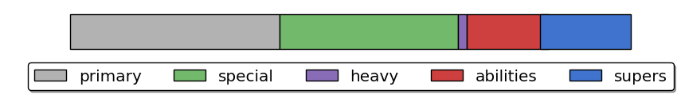

s---
layout: post
title: Passage Report Card for Firebase Delphi
excerpt: "First Python-generated Report Card"
modified: 2016-07-02
categories: articles
tags: [pvp,trials,data,report_card]
image:
  feature: header.png
comments: true
share: true
---

### Team Summary

1. **JohnOfMars** - The Titan
2. **XpLiCiTOnE** - The Hunter
3. **igordennis** - The Hunter

### Overall Team Performance

Playing for **113.0** minutes on **07/02/2016**.

Spawn Side: 6 times **Alpha**, 8 times **Bravo**

####Round Scores by Game

- Team K/D of 1.51, with a sweaty* K/D of 1.04
- Average round time of 69.3 seconds, or 78.3 seconds when sweaty*
- 8 out of 14 matches we had First Blood	
- 5 Aces vs 3 times Aced
- 4 Annihilation vs 0 times Annihilated
- 56 Resurrections vs 45 Enemy Resurrections Allowed
- 21 Orbs Missed out of 38 generated

####The Team's Kill Methods:

### Detailed Individual Performance

| #                      	| JohnOfMars 	| XpLiCiTOnE 	| igordennis 	|
|------------------------	|-----------	|-----------	|-----------	|
| Kills                  	| 67     	| 86     	| 112     	|
| Assists                	| 25     	| 22     	| 28     	|
| Deaths                 	| 63     	| 49     	| 64     	|
| K/D                    	| 1.06    	| 1.76    	| 1.75    	|
| Sweaty K/D*             	| 0.65   	| 1.26   	| 1.32    	|
| Percent Contribution**  	| 13.2 %  	| 38.6 %    	| 48.2 %    	|
| Last Guardian Actions***   | 7   	| 16   	| 18   	|
| Wrecking Balls         	| 0    	| 2    	| 4    	|
| Longest Kill Streak    	| 8   	| 10   	| 5   	|
| Longest Life           	| 132    	| 123    	| 131    	|
| Close Calls            	| 2    	| 4    	| 2    	|

| Kill Method Breakdown        	| JohnOfMars      	| XpLiCiTOnE      	| igordennis      	|
|----------------------------	|----------------	|----------------	|----------------	|
| % Primary vs Secondary     	| 48.9 %      	| 49.0 %      	| 61.1 %      	|
| Sniper Headshots / Kills   	| 0/0 	| 16/26 	| 24/28 	|
| Shotgun Kills              	| 23         	| 0         	| 0         	|
| Other Special Weapon Kills 	| 1         	| 0         	| 0         	|
| Heavy Weapon Kills         	| 0         	| 3         	| 1         	|
| Grenade Kills              	| 5          	| 10          	| 4          	|
| Melee Kills                	| 2          	| 7          	| 8          	|
| Super Kills                	| 10          	| 11          	| 19          	|

| Resurrections & Orbs      	| JohnOfMars      	| XpLiCiTOnE      	| igordennis      	|
|----------------------------	|----------------	|----------------	|----------------	|
| Resurrections Performed    	| 12        	| 25        	| 19        	|
| Resurrections Recieved        	| 21       	| 12       	| 23       	|
| Deaths Un-rezzed           	| 44       	| 30       	| 45       	|
| Orbs Generated             	| 17       	| 14       	| 7       	|
| Orbs Missed                	| 7      	| 5      	| 5      	|

### Definitions

1) **Sweaty K/D** is K/D on matches where the enemy team wins at least 3 rounds.

2) **Percent contribution** is a metric for determining how much you helped or hindered your team.

- +100 for kills
- -100 for deaths
- +33 for assists
- +25 for rezzes
- +12 for being rezzed

Scores are tabulated across all games for individuals and the team. And then a player's contribution is shown as percent of the team's total score.

3) **Last Guardian Actions** are:

- *'Never Say Die'* = Kill an enemy as the last guardian standing.
- *'From the Brink'* = Revive a teammate as the last guardian standing.
