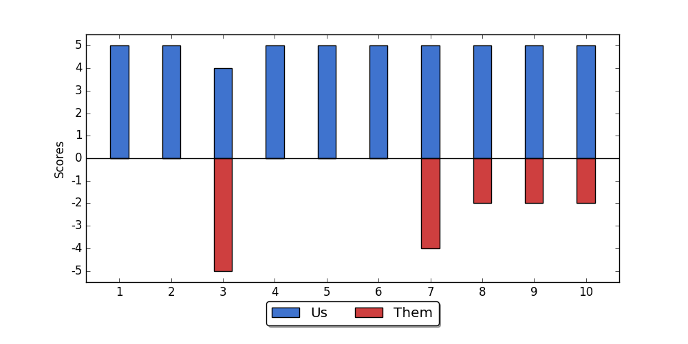

### Team Summary

1. **JohnOfMars** - The "Player1_class"
2. **XpLiCiTOnE** - The "Player2_class"
3. **igordennis** - The "Player3_class"

### Overall Team Performance

Playing for **75.3** minutes on **2016-07-23 21:48:47-04:00**.

Spawn Side: 8 times **Alpha**, 2 times **Bravo**

- Team K/D of 2.54, with a sweaty[^1] K/D of "teamskd"
- Average round time of 68.9 seconds, or "round_stime" seconds when sweaty[^1]
- 6 out of 10 matches we had First Blood	
- 12 Aces vs 3 times Aced
- 14 Annihilations vs 0 times Annihilated
- 43 Resurrections vs 34 Enemy Resurrections Allowed
- 21 Orbs Missed out of 21 generated

#### The Team's Kill Methods:

